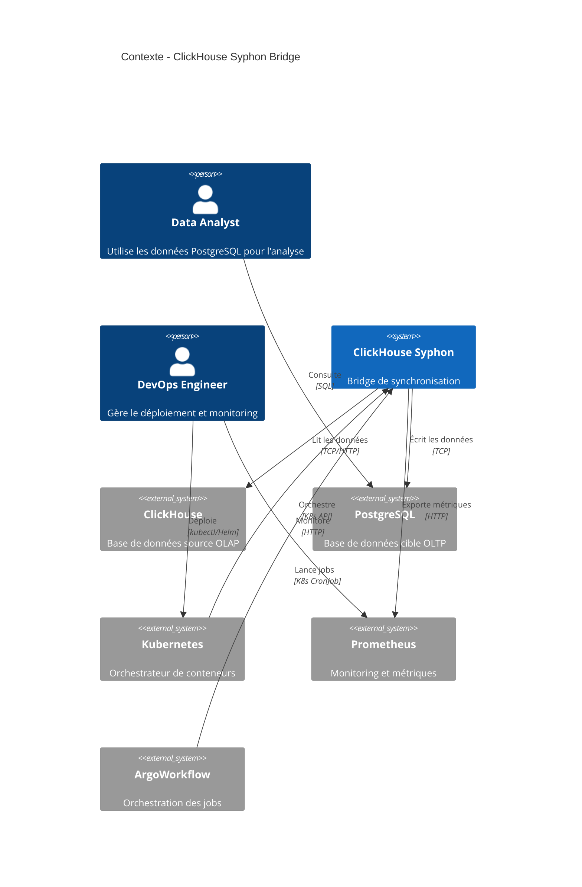
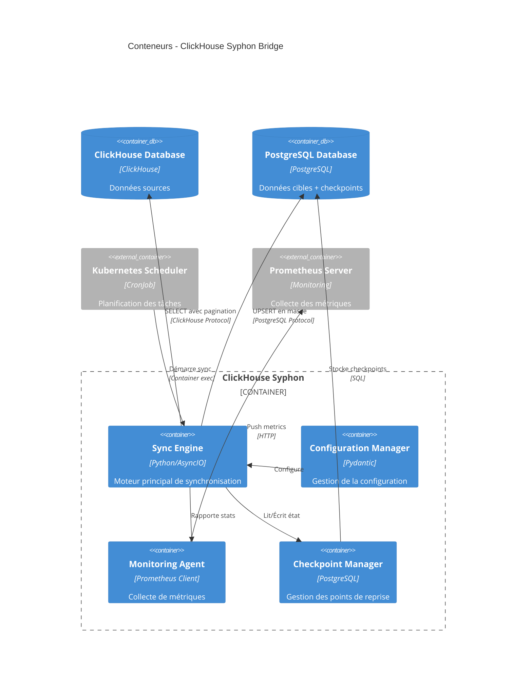
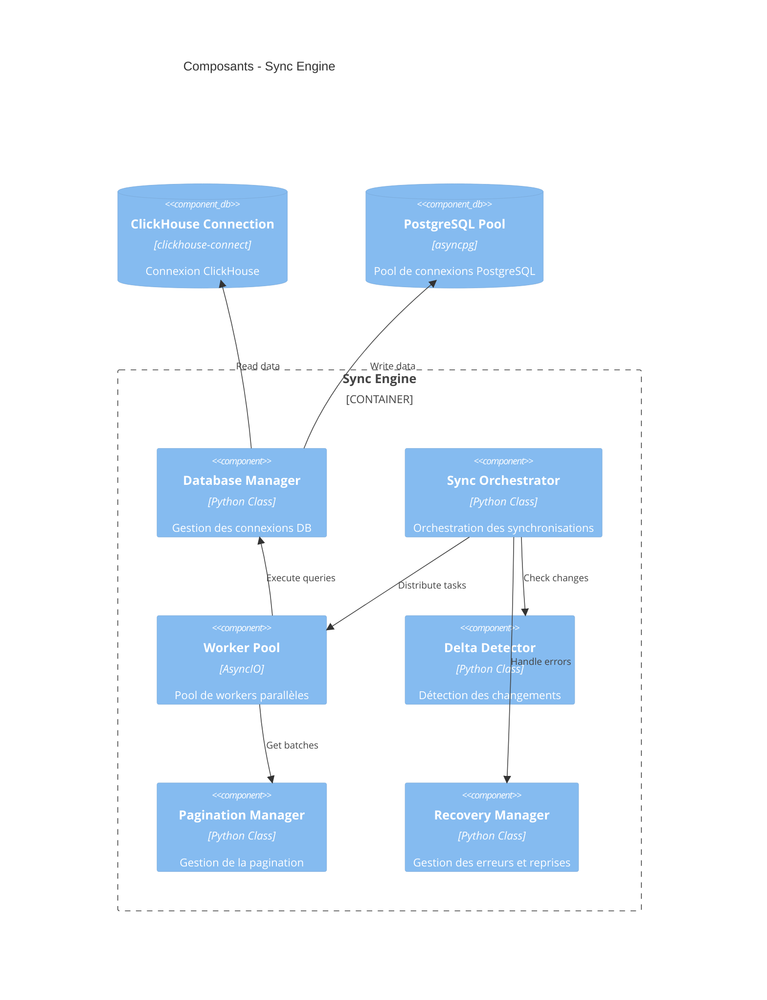
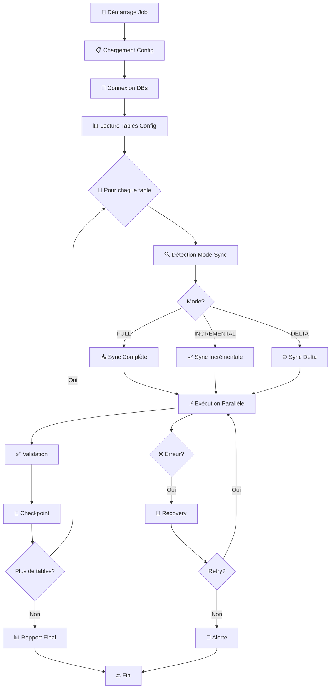
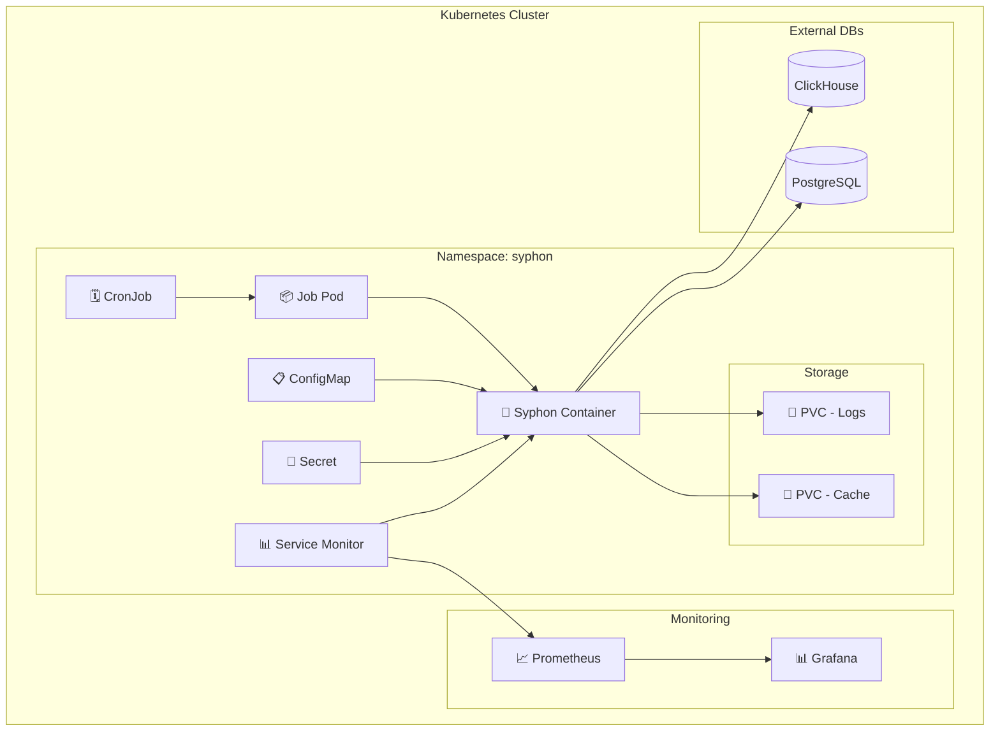
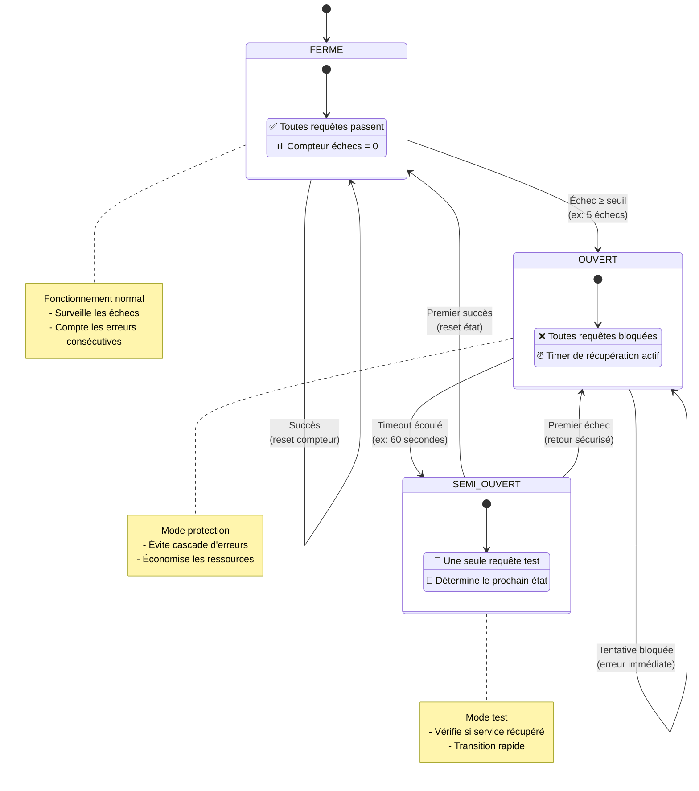

# Architecture et Fonctionnement - ClickHouse Syphon

## 🏗️ Vue d'ensemble de l'Architecture

ClickHouse Syphon est un bridge de synchronisation conçu pour transférer efficacement des données de ClickHouse vers PostgreSQL avec des capacités de monitoring, de parallélisation et de récupération d'erreurs.

### 🎯 Objectifs Architecturaux

-   **Performance** : 5x plus rapide que la fréquence de synchronisation
-   **Fiabilité** : Récupération automatique d'erreurs et gestion des reprises
-   **Scalabilité** : Parallélisation et gestion intelligente de la RAM
-   **Observabilité** : Monitoring complet et alerting
-   **Opérabilité** : Déploiement Kubernetes avec ArgoWorkflow

---

## 🏛️ Architecture C4 - Niveau Contexte



---

## 🏗️ Architecture C4 - Niveau Conteneurs



---

## 🧩 Architecture C4 - Niveau Composants



---

## 🔄 Flux de Données et Algorithmes

### 1. **Cycle de Synchronisation Global**



### 2. **Algorithme de Détection des Deltas**

````mermaid
flowchart TD
    A[🚀 Début Détection Delta] --> B{Premier Run?}

    B -->|Oui| C[📅 start_time = now() - initial_days]
    B -->|Non| D[📅 start_time = last_checkpoint]

    C --> E[📊 Compter les lignes]
    D --> E

    E --> F[🔢 SELECT count() FROM table<br/>WHERE timestamp >= start_time]
    F --> G[📈 total_rows = résultat]

    G --> H[🧮 Calculer taille batch optimale]
    H --> I[⚙️ optimal_batch_size = calcul_ressources()]

    I --> J[📦 Créer les batches]
    J --> K[📋 batches = []]

    K --> L[🔄 Pour offset = 0 à total_rows]
    L --> M[📦 Créer BatchInfo:<br/>• offset<br/>• limit = optimal_batch_size<br/>• where_clause]

    M --> N[➕ Ajouter batch à la liste]
    N --> O{Plus de données?}

    O -->|Oui| L
    O -->|Non| P[📊 Retourner DeltaInfo:<br/>• start_time<br/>• total_rows<br/>• batches[]<br/>• estimated_duration]

    P --> Q[✅ Fin]

    style A fill:#e1f5fe
    style Q fill:#c8e6c9
    style H fill:#fff3e0
    style J fill:#f3e5f5
```### 3. **Algorithme de Pagination Intelligente**

```mermaid
flowchart TD
    A[🚀 Calcul Taille Batch Optimale] --> B[📏 Estimer taille ligne moyenne]

    B --> C[🧮 taille_ligne = estimer_bytes(schema)]
    C --> D[💾 Calculer mémoire par worker]

    D --> E[📊 mem_worker = <br/>(RAM_dispo × 0.7) ÷ nb_workers]

    E --> F[🔢 Calculer lignes max par batch]
    F --> G[📈 lignes_max = mem_worker ÷ taille_ligne]

    G --> H[⚖️ Appliquer contraintes]
    H --> I{Vérifier limites}

    I --> J[📉 MIN = 1,000 lignes]
    I --> K[📈 MAX = 100,000 lignes]

    J --> L[🎯 taille_optimale = <br/>MAX(MIN, MIN(lignes_max, MAX))]
    K --> L

    L --> M[🌐 Vérifier latence réseau]
    M --> N{Latence > 100ms?}

    N -->|Oui| O[📈 Doubler la taille<br/>taille × 2]
    N -->|Non| P[✅ Garder taille actuelle]

    O --> Q[⚖️ Respecter MAX limite]
    P --> R[📊 Retourner taille_optimale]
    Q --> R

    R --> S[✅ Fin]

    style A fill:#e1f5fe
    style S fill:#c8e6c9
    style H fill:#fff3e0
    style M fill:#f3e5f5
    style O fill:#ffebee
````

---

## ⚡ Stratégies de Parallélisation

### 1. **Architecture des Workers**

```mermaid
graph TD
    A[🎯 Sync Orchestrator] --> B[📋 Task Queue]

    B --> C[⚡ Worker Pool]
    C --> D[👷 Worker 1]
    C --> E[👷 Worker 2]
    C --> F[👷 Worker N]

    D --> G[📊 Batch 1]
    E --> H[📊 Batch 2]
    F --> I[📊 Batch N]

    G --> J[🔄 ClickHouse Read]
    H --> K[🔄 ClickHouse Read]
    I --> L[🔄 ClickHouse Read]

    J --> M[💾 PostgreSQL Write]
    K --> N[💾 PostgreSQL Write]
    L --> O[💾 PostgreSQL Write]

    M --> P[✅ Success Report]
    N --> P
    O --> P

    P --> Q[📈 Progress Update]
    Q --> A
```

### 2. **Load Balancing Intelligent**

````mermaid
flowchart TD
    A[🎯 Nouvelle Tâche à Assigner] --> B[🔍 Scanner Workers Disponibles]

    B --> C[📊 Pour chaque worker:<br/>• charge_actuelle<br/>• capacité_max<br/>• tâches_en_cours]

    C --> D[🏆 Trouver worker moins chargé]
    D --> E[⚡ worker_optimal = MIN(charge_actuelle)]

    E --> F[🧮 Estimer complexité tâche]
    F --> G[📈 charge_estimée = calcul_batch()]

    G --> H{Worker peut gérer?}
    H -->|charge + estimée < max| I[✅ Assigner la tâche]
    H -->|charge + estimée ≥ max| J[⏳ Attendre qu'un worker se libère]

    J --> K[💤 sleep(100ms)]
    K --> L{Timeout atteint?}
    L -->|Non| B
    L -->|Oui| M[🚨 Erreur: Pas de worker disponible]

    I --> N[📝 Mettre à jour métriques:<br/>• worker.charge += estimée<br/>• worker.tâches.add(batch)<br/>• worker.dernière_assignation = now()]

    N --> O[📊 Retourner worker_id]
    O --> P[✅ Fin Succès]

    subgraph "Completion Callback"
        Q[📢 Tâche Terminée] --> R[📉 worker.charge -= estimée]
        R --> S[📋 worker.tâches.remove(batch)]
        S --> T[📈 worker.compteur_complété++]
    end

    style A fill:#e1f5fe
    style P fill:#c8e6c9
    style M fill:#ffcdd2
    style I fill:#c8e6c9
    style J fill:#fff3e0
```---

## 🔐 Gestion des Checkpoints et Recovery

### 1. **Modèle de Données des Checkpoints**

```sql
-- Table PostgreSQL pour stocker les checkpoints
CREATE TABLE syphon_checkpoints (
    id SERIAL PRIMARY KEY,
    table_name VARCHAR(255) NOT NULL,
    sync_mode VARCHAR(50) NOT NULL,
    last_sync_timestamp TIMESTAMP WITH TIME ZONE,
    last_processed_id BIGINT,
    rows_processed BIGINT DEFAULT 0,
    rows_inserted BIGINT DEFAULT 0,
    rows_updated BIGINT DEFAULT 0,
    sync_duration_seconds INTEGER,
    status VARCHAR(50) DEFAULT 'running',  -- running, completed, failed
    error_message TEXT,
    created_at TIMESTAMP WITH TIME ZONE DEFAULT NOW(),
    updated_at TIMESTAMP WITH TIME ZONE DEFAULT NOW(),

    UNIQUE(table_name, created_at)
);

-- Index pour les requêtes fréquentes
CREATE INDEX idx_checkpoints_table_status ON syphon_checkpoints(table_name, status);
CREATE INDEX idx_checkpoints_timestamp ON syphon_checkpoints(last_sync_timestamp);
````

### 2. **Algorithme de Recovery**

````mermaid
flowchart TD
    A[🚨 Erreur Détectée] --> B[🔍 Classification Erreur]

    B --> C{Type d'erreur?}

    C -->|Timeout Réseau| D[⏰ Stratégie Backoff]
    C -->|Mémoire Épuisée| E[📉 Réduire Batch Size]
    C -->|Deadlock| F[💤 Délai Court + Retry]
    C -->|Corruption Données| G[⚠️ Skip Batch + Alert]
    C -->|Connexion Perdue| H[🔌 Reconnexion]
    C -->|Erreur Inconnue| I[🆘 Escalade Humaine]

    subgraph "Backoff Strategy"
        D --> D1[📊 retry_count < max_retries?]
        D1 -->|Oui| D2[⏳ délai = base × 2^retry_count]
        D1 -->|Non| D3[❌ ÉCHEC DÉFINITIF]
        D2 --> D4[💤 Attendre délai]
        D4 --> D5[🔄 retry_count++]
        D5 --> J[🔄 RETRY]
    end

    subgraph "Batch Reduction"
        E --> E1[📏 new_size = current_size ÷ 2]
        E1 --> E2{new_size ≥ min_size?}
        E2 -->|Oui| E3[✂️ Diviser en 2 batches]
        E2 -->|Non| E4[❌ ÉCHEC - Batch trop petit]
        E3 --> E5[📦 batch1: [offset, new_size]]
        E5 --> E6[📦 batch2: [offset+new_size, reste]]
        E6 --> E7[➕ Ajouter à la queue]
        E7 --> K[🔄 SPLIT & RETRY]
    end

    F --> F1[💤 Attendre 1s]
    F1 --> J

    G --> G1[📝 Log erreur]
    G1 --> G2[🚨 Envoyer alerte]
    G2 --> L[⏭️ SKIP]

    H --> H1[🔌 Fermer connexions]
    H1 --> H2[🔗 Créer nouvelles connexions]
    H2 --> H3{Reconnexion OK?}
    H3 -->|Oui| J
    H3 -->|Non| M[❌ ÉCHEC CONNEXION]

    I --> I1[📋 Créer ticket]
    I1 --> I2[📧 Notifier équipe]
    I2 --> N[⏸️ PAUSE]

    J --> O[✅ Continuer Processing]
    K --> O
    L --> O
    D3 --> P[🔚 Arrêt]
    E4 --> P
    M --> P
    N --> P

    style A fill:#ffcdd2
    style O fill:#c8e6c9
    style P fill:#ffcdd2
    style J fill:#fff3e0
    style K fill:#e1f5fe
    style L fill:#fff9c4
```---

## 📊 Monitoring et Observabilité

### 1. **Métriques Prometheus**

```mermaid
graph TB
    subgraph "📊 Métriques de Performance"
        A[⏱️ sync_duration_seconds<br/>Histogramme<br/>Labels: table_name, sync_mode]
        B[📈 rows_processed_total<br/>Compteur<br/>Labels: table_name, operation]
        C[💾 batch_size_bytes<br/>Histogramme<br/>Labels: table_name]
    end

    subgraph "🔧 Métriques Système"
        D[👷 active_workers<br/>Jauge<br/>Nombre de workers actifs]
        E[🔌 connection_pool_size<br/>Jauge<br/>Labels: database_type]
        F[💾 memory_usage_bytes<br/>Jauge<br/>Labels: component]
    end

    subgraph "🚨 Métriques d'Erreurs"
        G[❌ sync_errors_total<br/>Compteur<br/>Labels: table_name, error_type]
        H[⏰ checkpoint_lag_seconds<br/>Jauge<br/>Labels: table_name]
        I[🔄 retry_attempts_total<br/>Compteur<br/>Labels: table_name, reason]
    end

    subgraph "🎯 Métriques Business"
        J[📊 data_freshness_seconds<br/>Jauge<br/>Labels: table_name]
        K[🔄 sync_frequency_per_hour<br/>Compteur<br/>Labels: table_name]
        L[📈 throughput_rows_per_second<br/>Jauge<br/>Labels: table_name]
    end

    style A fill:#e3f2fd
    style B fill:#e3f2fd
    style C fill:#e3f2fd
    style D fill:#f3e5f5
    style E fill:#f3e5f5
    style F fill:#f3e5f5
    style G fill:#ffebee
    style H fill:#ffebee
    style I fill:#ffebee
    style J fill:#e8f5e8
    style K fill:#e8f5e8
    style L fill:#e8f5e8
````

### 2. **Dashboard Grafana**

```yaml
# Exemple de panels Grafana
panels:
    - title: "Throughput par Table"
      type: graph
      targets:
          - expr: rate(syphon_rows_processed_total[5m])
            legendFormat: "{{table_name}}"

    - title: "Latence des Synchronisations"
      type: graph
      targets:
          - expr: syphon_sync_duration_seconds
            legendFormat: "{{table_name}} - {{sync_mode}}"

    - title: "Taux d'Erreurs"
      type: stat
      targets:
          - expr: rate(syphon_sync_errors_total[5m])

    - title: "Workers Actifs"
      type: gauge
      targets:
          - expr: syphon_active_workers

    - title: "Lag des Checkpoints"
      type: table
      targets:
          - expr: syphon_checkpoint_lag_seconds
            format: table
```

---

## ☸️ Déploiement Kubernetes

### 1. **Architecture Kubernetes**



### 2. **Manifestes Kubernetes**

```yaml
# cronjob.yaml
apiVersion: batch/v1
kind: CronJob
metadata:
    name: syphon-sync
    namespace: syphon
spec:
    schedule: "0 */6 * * *" # Toutes les 6 heures
    concurrencyPolicy: Forbid
    jobTemplate:
        spec:
            template:
                spec:
                    containers:
                        - name: syphon
                          image: syphon:latest
                          env:
                              - name: CLICKHOUSE__HOST
                                valueFrom:
                                    secretKeyRef:
                                        name: syphon-secrets
                                        key: clickhouse-host
                          volumeMounts:
                              - name: config
                                mountPath: /app/config
                              - name: logs
                                mountPath: /app/logs
                          resources:
                              requests:
                                  memory: "2Gi"
                                  cpu: "500m"
                              limits:
                                  memory: "8Gi"
                                  cpu: "2000m"
                    volumes:
                        - name: config
                          configMap:
                              name: syphon-config
                        - name: logs
                          persistentVolumeClaim:
                              claimName: syphon-logs
                    restartPolicy: OnFailure
```

### 3. **ArgoWorkflow Integration**

```yaml
# workflow.yaml
apiVersion: argoproj.io/v1alpha1
kind: Workflow
metadata:
    name: syphon-complex-sync
spec:
    entrypoint: sync-workflow
    templates:
        - name: sync-workflow
          dag:
              tasks:
                  - name: validate-connections
                    template: validate-step

                  - name: sync-critical-tables
                    template: sync-step
                    arguments:
                        parameters:
                            - name: tables
                              value: "orders,customers,products"
                    dependencies: [validate-connections]

                  - name: sync-analytics-tables
                    template: sync-step
                    arguments:
                        parameters:
                            - name: tables
                              value: "events,metrics,logs"
                    dependencies: [sync-critical-tables]

                  - name: validate-integrity
                    template: validate-step
                    dependencies: [sync-analytics-tables]

        - name: sync-step
          inputs:
              parameters:
                  - name: tables
          container:
              image: syphon:latest
              command: [python, -m, clickhouse_syphon.sync]
              args: ["--tables", "{{inputs.parameters.tables}}"]
```

---

## 🚀 Optimisations de Performance

### 1. **Optimisations ClickHouse**

````mermaid
flowchart TD
    A[🚀 Requête ClickHouse] --> B[🔍 Analyser Table Config]

    B --> C{Projections<br/>disponibles?}
    C -->|Oui| D[⚡ + projection_optimization=1]
    C -->|Non| E[📊 Vérifier colonnes timestamp]

    D --> E
    E --> F{Colonne<br/>timestamp?}
    F -->|Oui| G[📅 + force_index_by_date=1]
    F -->|Non| H[🗜️ Compression réseau]

    G --> H
    H --> I[🗜️ + compress=1]

    I --> J[⚡ Parallélisation]
    J --> K[👥 + max_threads=4]

    K --> L[📦 Format optimisé]
    L --> M[📊 + FORMAT Native]

    M --> N[🎯 Requête Optimisée]

    subgraph "Estimation Coût"
        O[📋 EXPLAIN PLAN] --> P[📊 Estimer lignes]
        P --> Q[💾 Estimer bytes]
        Q --> R[⏱️ Estimer temps]
        R --> S[📈 Coût Total]
    end

    N --> T{Estimer coût<br/>avant exec?}
    T -->|Oui| O
    T -->|Non| U[▶️ Exécuter Requête]

    S --> V{Coût<br/>acceptable?}
    V -->|Oui| U
    V -->|Non| W[⚠️ Requête trop coûteuse]

    U --> X[✅ Résultats]
    W --> Y[🔄 Optimiser davantage]

    style A fill:#e1f5fe
    style N fill:#c8e6c9
    style X fill:#c8e6c9
    style W fill:#ffcdd2
    style O fill:#fff3e0
```### 2. **Optimisations PostgreSQL**

```mermaid
flowchart TD
    A[📊 Données à insérer] --> B[📏 Analyser taille données]

    B --> C{Taille?}
    C -->|< 1K lignes| D[🔧 Upsert Simple]
    C -->|1K - 50K| E[📦 Upsert par Batch]
    C -->|> 50K| F[🚀 Upsert en Masse]

    subgraph "Upsert Simple"
        D --> D1[💾 INSERT ... ON CONFLICT]
        D1 --> D2[✅ Terminé]
    end

    subgraph "Upsert par Batch"
        E --> E1[📦 Diviser en batches de 5K]
        E1 --> E2[🔄 Pour chaque batch]
        E2 --> E3[💾 INSERT ... ON CONFLICT]
        E3 --> E4{Plus de batches?}
        E4 -->|Oui| E2
        E4 -->|Non| E5[✅ Terminé]
    end

    subgraph "Upsert en Masse"
        F --> F1[🏗️ Créer table temporaire]
        F1 --> F2[⚡ Copier structure originale]
        F2 --> F3[📥 COPY vers table temp]
        F3 --> F4[🔄 MERGE avec table principale]

        F4 --> F5[📊 WITH merged AS (<br/>    SELECT ...<br/>    FROM table_temp t<br/>    JOIN table_main m<br/>        ON t.pk = m.pk<br/>)]

        F5 --> F6[📝 INSERT nouvelles lignes]
        F6 --> F7[🔄 UPDATE lignes existantes]
        F7 --> F8[🗑️ DROP table temporaire]
        F8 --> F9[✅ Terminé]
    end

    D2 --> G[📊 Collecter métriques]
    E5 --> G
    F9 --> G

    G --> H[📈 Retourner résultat:<br/>• lignes_inserees<br/>• lignes_modifiees<br/>• duree_execution]

    H --> I[✅ Fin]

    style A fill:#e1f5fe
    style I fill:#c8e6c9
    style D fill:#e8f5e8
    style E fill:#fff3e0
    style F fill:#f3e5f5
    style G fill:#e1f5fe
````

````

---

## 🔧 Configuration et Tuning

### 1. **Configuration par Environnement**

```yaml
# config/production.yaml
environment: production

clickhouse:
    host: clickhouse-cluster.prod.company.com
    port: 9000
    connections:
        max_connections: 20
        connect_timeout: 30
        compression: lz4
    query_optimization:
        use_query_cache: true
        max_memory_usage: "8GB"
        max_threads: 8

postgresql:
    host: postgres-cluster.prod.company.com
    port: 5432
    pool:
        min_connections: 10
        max_connections: 50
        max_inactive_lifetime: 300
    optimization:
        statement_timeout: "30min"
        work_mem: "256MB"

sync_settings:
    default_batch_size: 50000
    max_parallel_workers: 8
    memory_limit: "16GB"
    performance_target: "5x_frequency"

monitoring:
    metrics_interval: 30
    alert_thresholds:
        error_rate: 0.05
        latency_p95: 300 # seconds
        checkpoint_lag: 3600 # seconds
````

### 2. **Auto-tuning des Performances**

```mermaid
flowchart TD
    A[🎯 Démarrage Auto-Tuning] --> B[📊 Collecte Métriques]

    B --> C[⏰ Métriques dernières 30min:<br/>• CPU utilization<br/>• Memory pressure<br/>• Network latency<br/>• Error rate<br/>• Throughput]

    C --> D[🔍 Analyse Performance]

    D --> E{Pression<br/>mémoire > 80%?}
    E -->|Oui| F[📉 Recommandation:<br/>batch_size ÷ 2]
    E -->|Non| G{CPU < 30%?}

    G -->|Oui| H[📈 Recommandation:<br/>workers + 2]
    G -->|Non| I{Latence > 200ms?}

    I -->|Oui| J[📦 Recommandation:<br/>batch_size × 1.5]
    I -->|Non| K{Taux erreur > 5%?}

    K -->|Oui| L[🐌 Recommandation:<br/>ralentir sync]
    K -->|Non| M[✅ Pas d'ajustement]

    F --> N{Confiance > 70%?}
    H --> N
    J --> N
    L --> N

    N -->|Oui| O[⚙️ Appliquer changement]
    N -->|Non| P[📝 Log recommandation]

    O --> Q[📊 Mesurer impact]
    Q --> R[📈 Enregistrer amélioration]

    R --> S[✅ Tuning terminé]
    P --> S
    M --> S

    subgraph "Métriques Collectées"
        T[💾 Memory: heap_used / heap_max]
        U[⚡ CPU: cpu_time / wall_time]
        V[🌐 Network: avg_latency]
        W[❌ Errors: failed_ops / total_ops]
        X[📈 Throughput: rows / second]
    end

    C -.-> T
    C -.-> U
    C -.-> V
    C -.-> W
    C -.-> X

    style A fill:#e1f5fe
    style S fill:#c8e6c9
    style O fill:#c8e6c9
    style F fill:#ffcdd2
    style H fill:#e8f5e8
    style J fill:#fff3e0
    style L fill:#fff9c4


```

---

## 📚 Patterns et Bonnes Pratiques

### 1. **Pattern Circuit Breaker**



### 2. **Pattern Observer pour Monitoring**

```mermaid
flowchart LR
    subgraph "🎯 Events Source"
        A[📊 Sync Started]
        B[✅ Sync Completed]
        C[❌ Sync Failed]
        D[⏰ Checkpoint Created]
    end

    subgraph "📡 Event Dispatcher"
        E[SyncEventObserver]
    end

    subgraph "👥 Observers"
        F[📈 PrometheusObserver]
        G[🚨 AlertingObserver]
        H[📝 LoggingObserver]
        I[📊 MetricsObserver]
    end

    A --> E
    B --> E
    C --> E
    D --> E

    E --> F
    E --> G
    E --> H
    E --> I

    subgraph "📈 Prometheus Actions"
        F --> F1[⬆️ sync_starts_total.inc()]
        F --> F2[⏱️ sync_duration.observe()]
        F --> F3[📊 rows_processed.add()]
    end

    subgraph "🚨 Alerting Actions"
        G --> G1{Erreur<br/>critique?}
        G1 -->|Oui| G2[📧 Email équipe]
        G1 -->|Non| G3[📱 Slack notification]

        G --> G4{Durée > seuil?}
        G4 -->|Oui| G5[⚠️ Alerte performance]
    end

    subgraph "📝 Logging Actions"
        H --> H1[📋 Structured logs]
        H --> H2[🔍 Trace correlation]
        H --> H3[📊 Audit trail]
    end

    subgraph "📊 Metrics Actions"
        I --> I1[📈 Business metrics]
        I --> I2[🎯 SLA tracking]
        I --> I3[📊 Trend analysis]
    end

    style E fill:#e1f5fe
    style F fill:#e8f5e8
    style G fill:#ffebee
    style H fill:#fff3e0
    style I fill:#f3e5f5
```

```

---

## 🎯 Conclusion Architecture

Cette architecture de ClickHouse Syphon offre :

### ✅ **Avantages Clés**

1. **Performance Garantie** : Architecture parallèle avec auto-tuning
2. **Fiabilité** : Checkpoints, recovery et circuit breakers
3. **Scalabilité** : Workers asynchrones et pagination intelligente
4. **Observabilité** : Monitoring complet et alerting
5. **Opérabilité** : Déploiement Kubernetes natif

### 🚀 **Extensibilité Future**

-   Support d'autres sources de données (MySQL, Oracle)
-   Transformation de données en temps réel
-   Réplication multi-région
-   ML pour prédiction des charges

L'architecture est conçue pour évoluer avec les besoins de l'entreprise tout en maintenant des performances et une fiabilité optimales.
```
